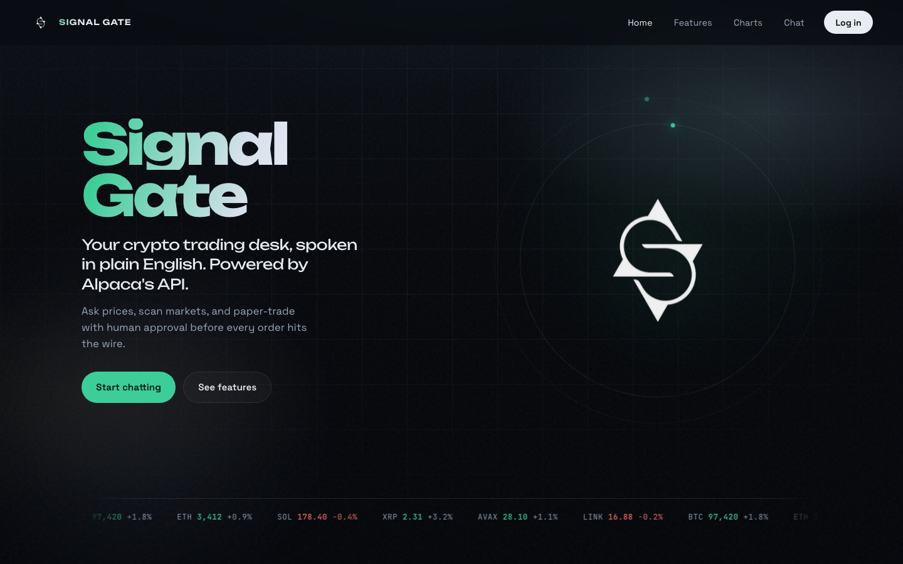
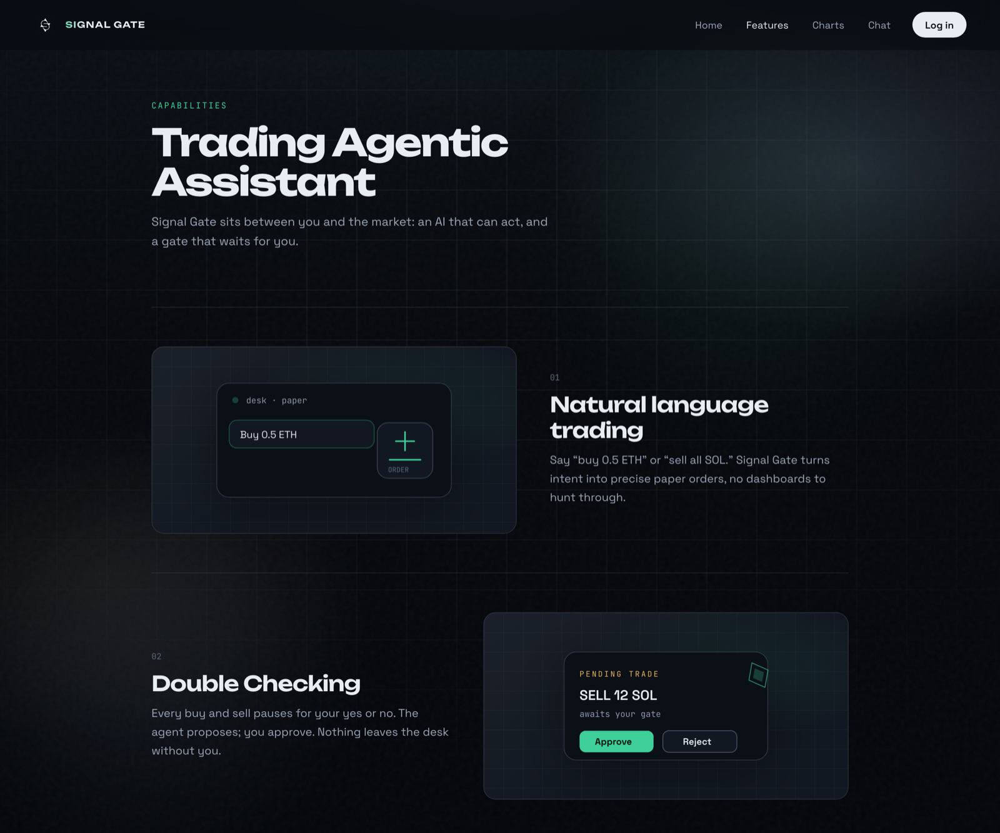
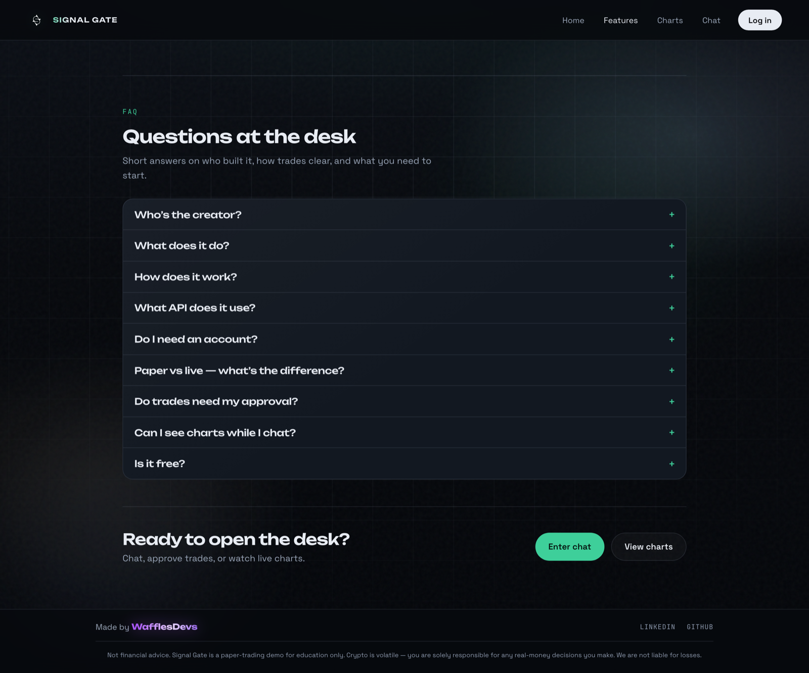
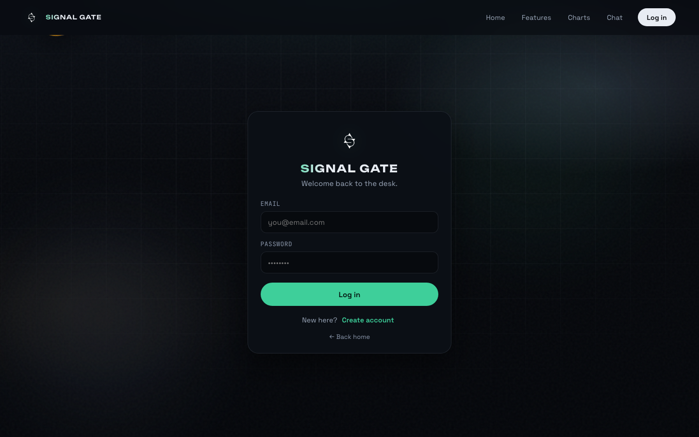
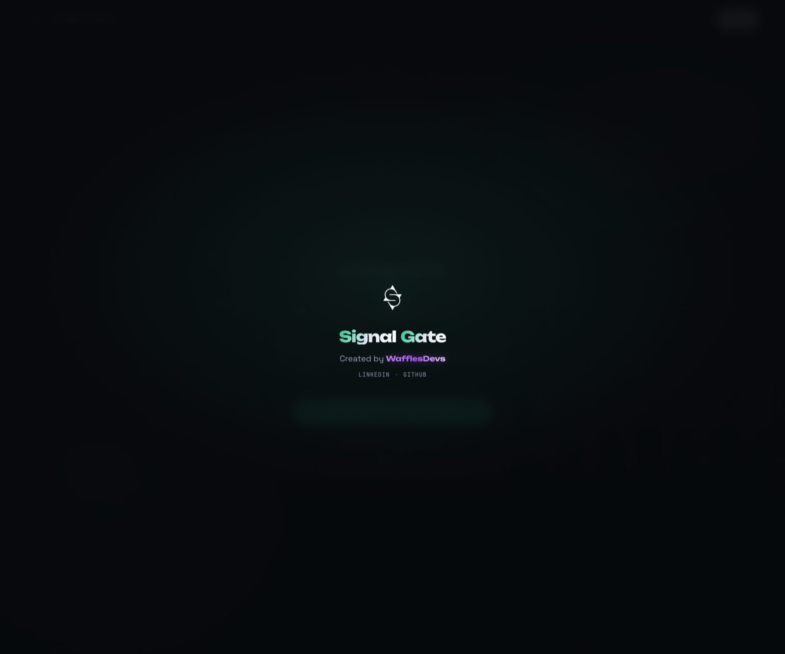

# Signal Gate

<p align="center">
  
</p>

<p align="center">
  <strong>Crypto AI paper-trading desk — spoken in plain English.</strong><br/>
  Ask prices, research markets, and route paper or live orders through Alpaca — with a human gate before anything hits the wire.
</p>

<p align="center">
  <a href="https://github.com/WafflesDevs/Signal-Gate"></a>
  
  
  
</p>

---

## What it is

Signal Gate is a chat-first trading desk for crypto. You talk to an agent; it reads your book and the market, proposes trades, and **waits for your approve / reject** before sending orders through your linked **Alpaca Trading API** keys (paper or live).

No order leaves the desk without you.

---

## Features

- **Natural language trading** — “buy 0.5 ETH”, “sell all SOL” → precise paper (or live) orders
- **HITL gate** — every buy/sell pauses for your yes or no
- **Active trades** — track open positions and exits from the desk
- **Live candle charts** — timeframe switches on real bars while you chat
- **Market + research** — prices, portfolio context, and web research on demand
- **Alpaca rails** — paper practice or live funds; keys linked per user in Settings
- **Paper / live toggle** — same desk, matching Alpaca dashboard keys

---

## Screenshots

<p align="center">
  
  <br/><em>Home — desk hero, ticker, markets</em>
</p>

<p align="center">
  
  <br/><em>Features — natural language orders + approve gate</em>
</p>

<p align="center">
  
  <br/><em>FAQ — paper vs live, approval, charts</em>
</p>

<p align="center">
  
  <br/><em>Login — welcome back to the desk</em>
</p>

<p align="center">
  
  <br/><em>Brand transition</em>
</p>

Chat, Charts, and Active trades sit behind auth after you link Alpaca in Settings.

---

## Setup

### 1. Backend

```bash
cd "Signal Gate"
python -m venv .venv
source .venv/bin/activate   # Windows: .venv\Scripts\activate
pip install -r requirements.txt
# or: uv sync

cp .env.example .env
# fill keys — see Env vars below (never commit .env)

uvicorn app.main:app --reload --port 8000
```

### 2. Frontend

```bash
cd frontend
cp .env.example .env
# set VITE_SUPABASE_URL + VITE_SUPABASE_ANON_KEY

npm install
npm run dev
```

UI: [http://localhost:5173](http://localhost:5173) · API: [http://localhost:8000](http://localhost:8000)

### 3. Supabase

1. Create a project and copy URL + anon + service_role keys  
2. Enable Email auth (confirm email recommended)  
3. Run [`supabase/schema.sql`](supabase/schema.sql) in the SQL Editor  
4. Full walkthrough: [`supabase/README.md`](supabase/README.md)

### Env vars

**Root `.env`** — copy from [`.env.example`](.env.example):

| Variable | Purpose |
|---|---|
| `OPENAI_API_KEY` | Agent / research |
| `TAVILY_API_KEY` | Web research |
| `CREDENTIALS_FERNET_KEY` | Encrypt per-user Alpaca secrets at rest |
| `SUPABASE_URL` / `SUPABASE_ANON_KEY` / `SUPABASE_SERVICE_ROLE_KEY` | Auth + DB |
| `FRONTEND_URL` / `CORS_ORIGINS` | Prod CORS when UI is on another origin (split deploy) |
| `LANGSMITH_*` / `LANGCHAIN_*` | Optional tracing |

**`frontend/.env`** — copy from [`frontend/.env.example`](frontend/.env.example):

| Variable | Purpose |
|---|---|
| `VITE_SUPABASE_URL` | Supabase project URL |
| `VITE_SUPABASE_ANON_KEY` | Public anon key |
| `VITE_API_BASE` (or `VITE_API_URL`) | Leave empty for same-origin / Vite proxy; set API URL only for split deploy |

> Do **not** put trading `ALPACA_API_KEY` / `ALPACA_SECRET_KEY` in project env for the trading stack. Users link Paper or Live keys in **Settings**; secrets are stored encrypted per user.

---

## Deploy on Render (free tier)

**Recommended: one free Web Service** — FastAPI serves the Vite build (`frontend/dist`) so you stay on a single free instance. Auth/DB stay on **Supabase** (no Render Postgres required).

Blueprint: [`render.yaml`](render.yaml) · build script: [`scripts/render-build.sh`](scripts/render-build.sh)

### Free-tier limits (read these)

| Limit | What it means for Signal Gate |
|---|---|
| **Spin-down after ~15 min idle** | First request after idle can take **30–60s+** (cold start). Health check is `/health`. |
| **Ephemeral disk** | `data/exit_rules.json` (SL/TP rules) is **lost on restart/spin-down**. Positions still live on Alpaca; re-set exits after wake if needed. |
| **Build minutes** | Monthly build quota; prefer Blueprint auto-deploy on `main` only. |
| **One free web service** | Prefer Option A below. Option B uses a free Static Site + free Web Service (two URLs + CORS). |

### Option A — single Web Service (recommended)

1. Push this repo to GitHub (private is fine): [WafflesDevs/Signal-Gate](https://github.com/WafflesDevs/Signal-Gate).
2. [Render Dashboard](https://dashboard.render.com) → **New** → **Blueprint** → connect the repo → apply [`render.yaml`](render.yaml).  
   Or **New → Web Service** → same repo, then:
   - **Runtime:** Python  
   - **Plan:** Free  
   - **Build:** `bash scripts/render-build.sh`  
   - **Start:** `uvicorn app.main:app --host 0.0.0.0 --port $PORT`  
   - **Health check path:** `/health`
3. Set **environment variables** (Dashboard → Environment). Secrets never go in git.

| Key | Notes |
|---|---|
| `OPENAI_API_KEY` | Required |
| `TAVILY_API_KEY` | Required for web research |
| `CREDENTIALS_FERNET_KEY` | Generate once; **never rotate lightly** (invalidates stored Alpaca secrets) |
| `SUPABASE_URL` | Project URL |
| `SUPABASE_ANON_KEY` | Anon/public key |
| `SUPABASE_SERVICE_ROLE_KEY` | Server only — never expose to the browser |
| `VITE_SUPABASE_URL` | Same as `SUPABASE_URL` (baked into the SPA at **build** time) |
| `VITE_SUPABASE_ANON_KEY` | Same as `SUPABASE_ANON_KEY` (build time) |
| `VITE_API_BASE` | Leave **empty** (same-origin API + UI) |
| `FRONTEND_URL` / `CORS_ORIGINS` | Optional for Option A (same origin) |

4. Deploy. Open `https://YOUR-SERVICE.onrender.com` — UI and API share one origin.  
5. Confirm `https://YOUR-SERVICE.onrender.com/health` → `{"status":"ok"}`.

### Option B — Static Site + Web Service (also free)

Use if the single-service Node+Python build is awkward. You get **two** free URLs:

1. **Web Service (API only):** build `pip install -r requirements.txt`, start same uvicorn command, health `/health`.
2. **Static Site:** build `cd frontend && npm ci && npm run build`, publish `frontend/dist`.
3. On the **API**, set `FRONTEND_URL` (or `CORS_ORIGINS`) to the Static Site URL.
4. On the **Static Site** build env, set `VITE_API_BASE=https://YOUR-API.onrender.com` (and Supabase `VITE_*` keys).
5. Redeploy both after changing `VITE_*` (they are compile-time).

### Supabase production URLs

In Supabase → **Authentication → URL Configuration**:

- **Site URL:** `https://YOUR-SERVICE.onrender.com` (Option A) or your Static Site URL (Option B)
- **Redirect URLs:** add `https://YOUR-SERVICE.onrender.com/**` (and keep `http://localhost:5173/**` for local dev)

### Frontend ↔ backend URLs

| Setup | Browser talks to API via |
|---|---|
| Local | Vite proxy (`VITE_API_BASE` empty) |
| Option A (Render) | Same origin (`VITE_API_BASE` empty) |
| Option B (Render) | `VITE_API_BASE=https://…-api.onrender.com` + API `CORS_ORIGINS` / `FRONTEND_URL` |

### Common pitfalls

- **Cold start looks “down”** — wait for the free instance to wake; hit `/health` once.
- **Changed `VITE_*` but UI still wrong** — trigger a **new build** (Vite inlines env at build time).
- **Auth redirect fails** — production domain missing from Supabase Redirect URLs / Site URL.
- **CORS errors** — only on Option B; set `FRONTEND_URL` on the API to the exact Static Site origin (https, no trailing slash mismatch).
- **SL/TP “vanished”** — free disk is ephemeral; rules file resets after sleep/redeploy.
- **Do not commit `.env`** — already gitignored; use Render env + `.env.example` only.
- **Keep one uvicorn worker** — exit monitor runs inside the app lifespan; don’t raise workers on free tier.

---

## Tech stack

| Layer | Stack |
|---|---|
| API | FastAPI, Uvicorn, LangChain / LangGraph, Alpaca (`alpaca-py`) |
| UI | React, Vite, TypeScript, Framer Motion, Lightweight Charts |
| Auth / data | Supabase (Auth + Postgres) |
| Broker | Alpaca Trading API (paper + live) |

---

## Links

- **Repo** (private): [github.com/WafflesDevs/Signal-Gate](https://github.com/WafflesDevs/Signal-Gate)
- **Alpaca**: [alpaca.markets](https://alpaca.markets)
- **Supabase setup**: [`supabase/README.md`](supabase/README.md)

---

## Credit

Built by **[WafflesDevs](https://github.com/WafflesDevs)**  
[LinkedIn](https://www.linkedin.com/in/ayaanalii/) · [GitHub](https://github.com/WafflesDevs)

---

<p align="center">
  <sub>Paper-trading desk for education and experimentation. Not financial advice. Live trading uses your own capital and Alpaca’s terms.</sub>
</p>
